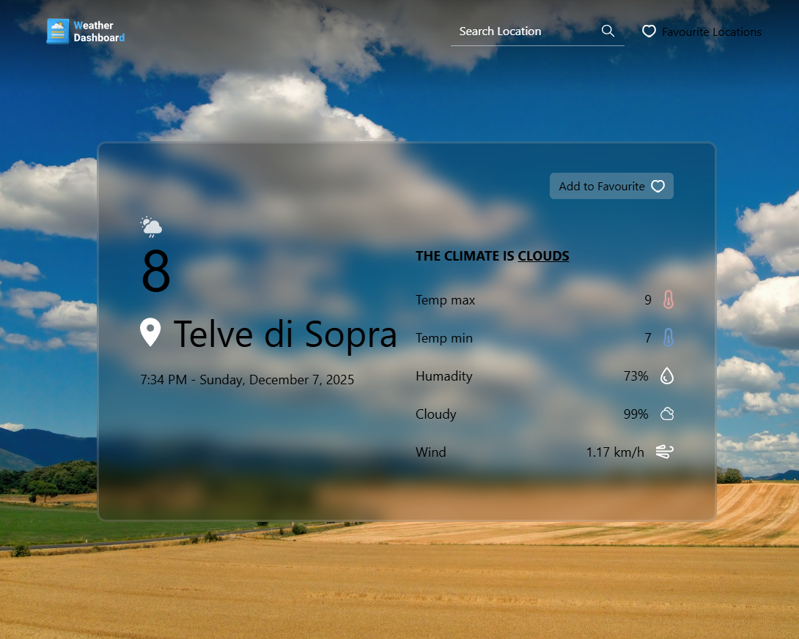

# Weather Dashboard 🌤️
A responsive web application built with **React.js** that provides current weather information and forecasts for major world capitals. Users can search for weather data by entering capital city names (e.g., **Dhaka, Ottawa, Moscow, Rome, Paris, New Delhi, Beijing, Islamabad, Cairo**). Favorite cities can be added for quick access. The app fetches real-time data from a weather API and displays it in an intuitive, clean dashboard.

---

## 🖼️ Weather Dashboard Screenshot
*(Add your screenshot here)*

---

## 🚀 Features

### 🔍 Search Functionality
Search for weather by typing **country capital names only**. This ensures accurate and consistent API results.

### ⭐ Favorites Management
- Add cities to your favorites  
- View favorites inside a modal  
- Remove items easily  
- Favorites persist using **localStorage**

### 🌡️ Current Weather Display
- Weather headline  
- Climate condition  
- Temperature  
- Detailed conditions (humidity, wind, etc.)

### 📱 Responsive Design
Optimized for both desktop and mobile devices.

### 🧭 Header Navigation
Includes:
- Logo  
- Search bar  
- Favorites access icon  

---

## 🛠️ Component Structure


The app follows a modular, scalable **React** structure:

```
Main
 └── App
      └── Page
           ├── Header
           │     ├── Logo
           │     ├── Search
           │     ├── FavoriteIcon  ← triggers FavouriteListModal
           │ 
           └── WeatherBoard
                 ├── AddToFavourite
                 ├── WeatherHeadline
                 └── WeatherCondition

```

### Header  
Handles navigation, logo, search, and favorites access.

### WeatherBoard  
Shows weather details and the Add to Favourite button.

### FavouriteListModal  
Displays saved favorite cities and allows removal.

---

## 🧰 Tech Stack

- **Frontend:** React.js (Hooks)  
- **Styling:** CSS Modules / Tailwind CSS  
- **API:** OpenWeatherMap (or similar)  
- **State:** React Context + localStorage  
- **Deployment:** Vercel  

---

## 📦 Prerequisites

- Node.js **v14+**  
- npm 
- Weather API key  

---
## 📘 Usage

### 🔍 Search Weather
- Type a **capital city** in the search bar (e.g., *Paris*)
- Weather results will automatically appear on the **WeatherBoard** after 3 seconds.

**Supported example capitals:**
Dhaka, Ottawa, Moscow, Rome, Paris, New Delhi, Beijing, Islamabad, Cairo and many more.

---

### ⭐ Add Favorites
- Click **Add to Favourite** on the WeatherBoard
- Open your favorites using the **Favorites icon** in the header
- Remove or manage saved cities anytime

Your favorites are stored using **localStorage**, so they remain saved even after refreshing the page.

---

### 🌦️ Weather Details
- **WeatherHeadline:** Quick summary (e.g., *“Sunny, 22°C”*)
- **WeatherCondition:** Shows humidity, wind speed, feels-like, and other details

---

## 🚀 Deployment (Vercel)

To deploy your own version:

1. Push the repository to GitHub  
2. Connect the repository to **Vercel**  
3. Add your API key inside Vercel **Environment Variables**  
4. Deploy — Vercel will build automatically after every push

### 🔗 Live Demo  
https://weather-dashboa


## 🔧 Installation

### 1. Clone the repository
```bash
git clone https://github.com/peyalhasan/Weather-Dashboard.git
cd Weather-Dashboard

npm install

```
## 📬 Contact

If you have questions, feedback, or feature requests, feel free to reach out.

**👤 Author:**  
Peyal Hasan

**🌐 GitHub Profile:**  
[https://github.com/peyalhasan](https://github.com/peyalhasan)

**📨 Email:**  
peyalhasan.dev@gmail.com  <!-- Replace with your real email if needed -->

**🔗 Live Demo:**  
[https://weather-dashboard-peyal.vercel.app/](https://weather-dashboard-peyal.vercel.app/)

---

## 📄 Copyright

© 2025 Peyal Hasan. All rights reserved.

This project is open-source and free to use for learning purposes.  
You may not copy, redistribute, or commercially use the design, layout, or code without proper permission from the author.
